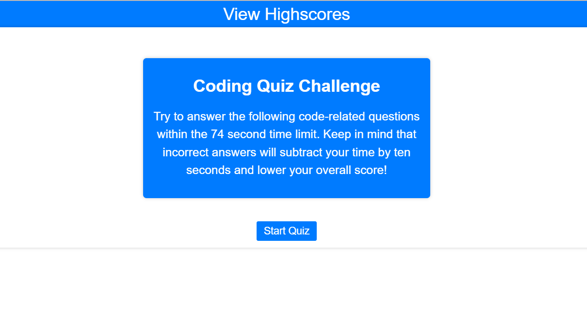

# Coding Challenge Website

## coding-quiz-website

- This website will provide practice for future web developers in their job interviews

##  Features :

1) A selection of technical questions.
2) A timer to motivate the user.
3) A high score page for the more competitive users.

# TECHNOLOGIES USED 

## Development Tools 
 

  

# User Story
- AS A coding boot camp student
- I WANT to take a timed quiz on JavaScript fundamentals that stores high scores
- SO THAT I can gauge my progress compared to my peers

# Acceptance Criteria
- GIVEN I am taking a coding quiz
- WHEN I click the start button
- THEN a timer starts and I am presented with a question
- WHEN I answer a question
- THEN I am presented with another question
- WHEN I answer a question incorrectly
- THEN time is subtracted from the clock
- WHEN all questions are answered or the timer reaches 0
- THEN the game is over
- WHEN the game is over
- THEN I can save my initials and score

  

# UI SneakPeak ❤️ 

  

# Refrences

- [Mozilla](https://developer.mozilla.org/en-US/docs/Web/JavaScript/Data_structures)

- [Eloquent-JavaScript](https://eloquentjavascript.net/)

- [MeyerWeb](https://meyerweb.com/eric/tools/css/reset/)

  

**For more, reach me at: laryn.n99@gmail.com**

